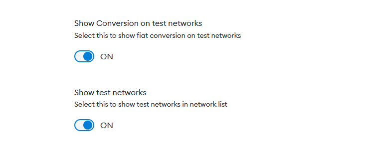
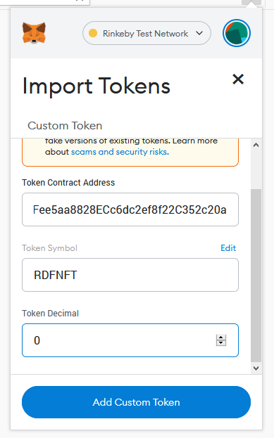

# RDF Dataset verification using Linkchain, Ethereum and Solid
 
 Contents
 --------
 
*   [Overview](#overview)
*   [Linkchain RDF Verification](#linkchain-rdf-verification)
*   [MetaMask and the Rinkby Ethereum Testnet](#metamask-and-the-rinkby-ethereum-testnet)
      *   [Installing MetaMask](#installing-metamask)
      *   [Working with MetaMask](#working-with-metamask)
      *   [Viewing your NFT Tokens in MetaMask](#viewing-your-nft-tokens-in-metamask)
 
*   [Solid and the Inrupt API](#solid-and-the-inrupt-api)
      *   [Creating an Inrupt Solid Pod](#creating-an-inrupt-solid-pod)
      *   [Working with the Inrupt API](#working-with-the-inrupt-api)
 
*   [NFT Storage](#nft-storage)
*   [Smart Contracts](#smart-contracts)
      *   [MerQLAnchor Smart Contract](#merqlanchor-smart-contract)
      *   [RDFTokens Contract](#rdftokens-contract)
      *   [RDFTokens Metadata Example](#rdftokens-metadata-example)
 
*   [Stepping Through the Demo](#stepping-through-the-demo)
*   [Useful Resources](#useful-resources)
 
* * *
 
## Overview
 
To assist you in your aims at the summer school, we have written a demonstrator that shows a collection of software, working together to create a client-side application that can validate RDF datasets on the blockchain using the Linkchain library.  
Here is the overall architecture of the elements in the demo:  
  
We will now go through each of these elements in turn.

* * *

## Linkchain RDF Verification

Main linkchain Library functions used in this demonstrator:

```
getVerificationMetadata: async function (quads, options)
```

Code snippet from ISWS 2022 Demonstrator:
```
try {
  const inputarea = document.getElementById('inputarea');
  quadsFinal = inputarea.value;

  if (quadsFinal != "" && quadsFinal != null) {
    metadata = await linkchains.getVerificationMetadata(quadsFinal, {});

    const verificationMetadataResult = document.getElementById('verificationMetadataResult');
    verificationMetadataResult.value = JSON.stringify(metadata, null, 2);

    // also add to next stage for non solid workflow
    const verificationMetadata = document.getElementById('verificationmetadatainputarea');
    verificationMetadata.value = JSON.stringify(metadata, null, 2);

    // also add to next stage for non solid workflow
    const verificationMetadataTokenInputArea = document.getElementById('verificationMetadataTokenInputArea');
    verificationMetadataTokenInputArea.value = JSON.stringify(metadata, null, 2);
  } else {
    alert("Please select a file of RDF first");
  }
} catch (e) {
  console.log(e);
}

```

* * *
```
anchorMetadata: async function (metadata, options, anchorFunction)
```

Code snippet from ISWS 2022 Demonstrator:
```

let dataToAnchor = <the rdf code that was anchored>;

let options = {
  address: cfg.tokenContractAddress,
  account: account,
  transactionHash:"0x0x0000000000000000000000000000000000000000",
  anchorType : 'RDFTokens',
  tokenName: name,
  tokenDescription: description,
  tokenImageURL: imageurl
}

const handler = async function(anchor, options) {
  let reply = await issueToken(anchor, options);
  return reply;
}

const anchoredMetadata = await linkchains.anchorMetadata(dataToAnchor, options, handler);

```

* * *
```
getGranularVerificationMetadata: async function (quads, metadata)
```

Code snippet from ISWS 2022 Demonstrator:
```
const rdfInputData = <the rdf code that was acnhored>
const anchoredData = <data returned from linkchains.anchorMetadata>
const granularMetaData = await linkchains.getGranularVerificationMetadata(rdfInputData, anchoredData);
```

* * *
```
verify: async function (quads, metadata, options, retrieveAnchor)
```
Code snippet from ISWS 2022 Demonstrator:
```

const rdfInputData = <the rdf code that was acnhored>
const anchoredMetadata = <the data returned from a call to linkchains.anchorMetadata>
let options = {}

const handler = async function(anchor, options) {
  // check if merkle or blockchain verification
  let reply = "";
  if (anchor.type == "ETHMerQL") {
    reply = await readMerQLAnchorContract(anchor, options);
  } else if (anchor.type == "RDFTokens") {
    reply = await readTokenMetadata(anchor, options);
  }

  return reply;
}

const output = await linkchains.verify(rdfInputData, anchoredMetaData, options, handler);

```

* * *

## Metamask and the Rinkby Ethereum Testnet

MetaMask (https://metamask.io/) is a free web and mobile crypto wallet that allows users to store and swap cryptocurrencies, interact with the Ethereum blockchain ecosystem, and host a growing array of decentralized applications (dApps)

### Installing MetaMask

You will need to install Metamask in your browser to interact with our demo and any experiments of your own that you undertake.  
It is currently available as a plugin for Chrome, Firefox, Edge and Brave: [https://metamask.io/download/](https://metamask.io/download/).  
  
We have pre-created MetMask wallet accounts for you, which we have seeded with some Rinkby ether. You will be given the details of your MetaMask wallet's Secret Recovery Phrase by John at the summer school and will be able to use that to create your wallet in MetaMask. Once installed in your browser you should see a fox head icon appear in your browser bar.  
  
Here is an example of what it looks like in FireFox:  
  
  
  
Click the icon to open the MetaMask app. You should see something similar to this:  
  
  
  
Click **'Get Started'**, and this will open a page simiar to this:  
  
  
  
Click **'Import wallet'**, and that will open a page similar to this:  
  
  
  
You then can click either button depending on your preference. You should then see something similar to the following screen:  
  
  
  
Please enter your Secret Recovery Phrase here and a password to secure your account.  
  
Once you have created your wallet, you will automatically be able to switch between a set of public Ethereum blockchain networks.  
For our demo, we have used the Rinkby Tesnet. So before interacting with our demo, please select the Rinkby Testnet in your MetaMask Wallet.  
  
  

If it is unavailable, you will need to go to the settings / advanced and turn on the test networks

  
  
Your account should be pre-seeded with 1 Rinkgy eth. Transaction costs are low on Rinbky so this should be sufficient.  
However, if you require more eth at any point, you can request 0.5 eth a day from this Faucet: [Top up your Rinkby Eth (0.5 eth a day)](https://faucet.paradigm.xyz/)  
  

### Working with MetaMask

To interact with the blockchain through Metamask, we use the ethers.js library by including the following script in our webpage: 'https://cdn.ethers.io/lib/ethers-5.2.umd.min.js'.

Before you can connect to MetaMask to talk to the blockchain, you must have logged into MetaMask in your browser. In our demonstraotr, in the first tab, you will see a button called 'Connect To MetaMask'. This button will only be available if you have not already logged into MetaMask in your current browser session. Clicking this will launch the MetaMask app and you will be asked to login and permission the website to interact with it.  
  
See the function _'loginToMetaMask'_ in _'app.js'_ in our demo source code for full details.  
  
**Note:** Please Make sure you select the Rinkby Testnet before continuing, if you intend to issue RDF Tokens using our demonstrator, as that is the network that holds the RDFToken Contract instance used by the demo.

From their documentation, you connect to Metamask, in the following way:

// A Web3Provider wraps a standard Web3 provider, which is
// what MetaMask injects as window.ethereum into each page
const provider = new ethers.providers.Web3Provider(window.ethereum)

// The MetaMask plugin also allows signing transactions to
// send ether and pay to change state within the blockchain.
// For this, you need the account signer...
const signer = provider.getSigner()		
		

In our _'loginToMetaMask'_ function we use the following to prompt MetaMask:  
  

// MetaMask requires requesting permission to connect users accounts
await provider.send("eth\_requestAccounts", \[\]);
		

For full details, their documentation can be found here: [https://docs.ethers.io/v5/](https://docs.ethers.io/v5/)  
  
  
### Viewing your NFT Tokens in MetaMask

If you want to see your RDF NFT Tokens in your MetMask Wallet on the Rinkby Ethereum blockchain, you will need to do the following:

- Open MetaMask and switch toi the Rinkby Network, if you are not already on it.
- At the bottom select the 'Assets' tab, if not already selected
- Select 'Import Tokens'
- In the form set the:
  - 'Token Contract Address' to '0x0a07137A9Fee5aa8828ECc6dc2ef8f22C352c20a' - this is the Token Contract Address for our demo.
  - The 'Token Symbol' should auto complete as 'RDFNFT'
  - The 'Token Decimal' should be set to '0'
- Once you press the 'Add Custom Token' button, you should see the number of RDFNFTs you have listed in the Assets list.

  

* * *

## Solid and the Inrupt API

Solid is a technology for organizing data, applications, and identities on the web. Solid enables richer choices for people, organizations and app developers by building on existing web standards.  
More information can be read here: https://inrupt.com/solid/

### Creating an Inrupt Solid Pod

Our demonstrator uses Solid as a file store. In order to store and retreive files in the demo, you will first need to create yourself an inrupt.com solid pod.  
Sign up for an Inrupt Solid Pod here: [https://signup.pod.inrupt.com/](https://signup.pod.inrupt.com/)  
  
For more information on using your Solid pod from the Inrupt podbrowser interface, please see their documentation: [https://docs.inrupt.com/user-interface/podbrowser/](https://docs.inrupt.com/user-interface/podbrowser/)  

### Working with the Inrupt API

We have create an separate Inrupt library, ([https://github.com/KMiOpenBlockchain/isws2022-inrupt](https://github.com/KMiOpenBlockchain/isws2022-inrupt)), that this demo uses to call Solid and read and write files. Please see the source code and speparate read me on using this library.
  
[https://inrupt.com/products/dev-tools](https://inrupt.com/products/dev-tools)  
[https://docs.inrupt.com/developer-tools/javascript/client-libraries/](https://docs.inrupt.com/developer-tools/javascript/client-libraries/)

* * *

## NFT Storage


Traditionally, NFTs (Non-Fungible Tokens) use [IPFS](https://ipfs.io/) (InterPlanetary File System) to store their metadata, as it is secured with a hash. In our demo, we are using the [NFT.Storage](https://nft.storage) API to put NFT metadata onto the public IPFS network.

"NFT.Storage is a long-term storage service designed for off-chain NFT data (like metadata, images, and other assets) for up to 31GiB in size per individual upload. Data is content addressed using IPFS, meaning the URI pointing to a piece of data ("ipfs:...") is completely unique to that data (using a content identifier, or CID). IPFS URLs and CIDs can be used in NFTs and metadata to ensure the NFT forever actually refers to the intended data (eliminating things like rug pulls, and making it trustlessly verifiable what content an NFT is associated with)."

We have created an API key for our demo to use this service. It has the following usage limits:  

*   A total request body size limit of 100MB.
*   No more than 30 requests with the same API token within a ten second window.

Otherwise a 429 will be returned.  
  
We do not anticipate this limit being an issue for the demo.  
However, you may prefer to get your own api key for your own project. It is free to sign up and use their service. Please see their documentation for more details: [https://nft.storage/docs/#get-an-api-token](https://nft.storage/docs/#get-an-api-token)

  
  

For our demo we are creating the IPFS file in the following format: [RDFTokens Metadata Example](nftmeta), as a JSON string and then using the NFT.Storage api call _'https://nft.storage/api/upload'_ and passing the string as a Blob.  
See the function _'storeToIPFS(content)'_ in _'app.js'_ in our demo source code for full details.

* * *

## Smart Contracts

### MerQLAnchor Smart Contract
```
pragma solidity ^0.5.7;

contract MerQLAnchor {
    string public targetHash;
    uint256 public creationTime;
    address public owner;
    string public indexType; // Defines how data was split: uniform = data split based on LSD and divisor, subject = based on hash of subject term, object = based on hash of object term, predicate = based on hash of predicate term, graph = based on hash of graph term, subjectobject = based on hash of subject & object term
    uint256 public leastSignificantDigits;
    string public divisor;
    string public quadHashFunction;
    string public treeHashFunction;
    string public indexHashFunction;

    constructor(
        string memory hashIn,
        string memory newIndexType,
        uint256 lsds,
        string memory div,
        string memory quadHashFunctionIn,
        string memory treeHashFunctionIn,
        string memory indexHashFunctionIn
    ) public {
        owner = msg.sender;
        targetHash = hashIn;
        creationTime = block.timestamp;
        leastSignificantDigits = lsds;
        divisor = div;
        indexType = newIndexType;
		quadHashFunction = quadHashFunctionIn;
		treeHashFunction = treeHashFunctionIn;
		indexHashFunction = indexHashFunctionIn;
    }

    function getData()
        public
        view
        returns (
            uint256 theCreationTime,
            address theOwner,
            string memory thetargetHash,
            string memory theIndexType,
            uint256 leastSignificants,
            string memory theDivisor,
        	string memory theQuadHashFunction,
        	string memory theTreeHashFunction,
        	string memory theIndexHashFunction
        )
    {
        theCreationTime = creationTime;
        theOwner = owner;
        thetargetHash = targetHash;
        theIndexType = indexType;
        leastSignificants = leastSignificantDigits;
        theDivisor = divisor;
		theQuadHashFunction = quadHashFunction;
		theTreeHashFunction = treeHashFunction;
		theIndexHashFunction = indexHashFunction;
    }
}
```

### RDFTokens Contract

```
// SPDX-License-Identifier: MIT
pragma solidity ^0.8.0;

import "@openzeppelin/contracts/token/ERC721/extensions/ERC721URIStorage.sol";
import "@openzeppelin/contracts/utils/Counters.sol";

contract RDFTokens is ERC721URIStorage {
    using Counters for Counters.Counter;
    Counters.Counter private \_tokenIds;

	event TokenMint(
		address indexed recipient,
		string tokenurl,
		uint256 indexed tokenid
	);

    constructor() ERC721("RDFTokens", "RDFNFT") {}

    function mintToken(address recipient, string memory tokenURI)
        public
        returns (uint256)
    {
        uint256 newItemId = \_tokenIds.current();
        \_mint(recipient, newItemId);
        \_setTokenURI(newItemId, tokenURI);

        emit TokenMint(recipient, tokenURI, newItemId);

        \_tokenIds.increment();
        return newItemId;
    }
}	
```

### RDFTokens Metadata Example
```
{
	"name": "Test RDF Token",
	"description": "A RDF dataset of some sort",
	"image": "https://www.w3.org/Icons/SW/sw-cube-v.svg",
	"merqlanchor": {
		"type": "ETHMerQL",
		"address": "0x3133b44EA7de878bc2D06A0Baf33c90d54AdC731",
		"account": "0x000B60166e51E7149137789E264cD6A51C62Af48",
		"indexhash": "5c8a8a741513236641eb6165e96cf17c9176157d4d34c8836b3fea72f5b294e6",
		"settings": {
			"quadHash": "KECCAK-256",
			"treeHash": "KECCAK-256",
			"indexHash": "KECCAK-256",
			"lsd": 64,
			"indexType": "subject",
			"divisor": 1
		},
		"transactionhash": "0x0x0000000000000000000000000000000000000000"
	}
}
```		

* * *

## Stepping Through the Demo

[](https://blockchain7.kmi.open.ac.uk/movies/movies/iswssummerschooldemo.mp4)

* * *

## Useful Resources:

*   [MetaMask Developer Documentation](https://docs.metamask.io/guide/)
*   [Top up your Rinkby Eth (0.5 eth a day)](https://faucet.paradigm.xyz/)
*   [Etheres.js documentation](https://docs.ethers.io/v5/)
*   [About Solid](https://inrupt.com/solid/)
*   [Sign Up To Solid](https://signup.pod.inrupt.com/)
*   [Solid Pod Browser Documentation](https://docs.inrupt.com/user-interface/podbrowser/)
*   [Inrupt Solid developer tools](https://inrupt.com/products/dev-tools)
*   [Inrupt Libraries](https://docs.inrupt.com/developer-tools/javascript/client-libraries/)
*   [About IPFS](https://ipfs.io/)
*   [About Net.Storage](https://nft.storage/)
*   [NFT.Storage - Get an API Token](https://nft.storage/docs/#get-an-api-token)
*   [Open Zeppelin NFT Token contracts](https://docs.openzeppelin.com/contracts/4.x/)
*   [Remix - Solidity IDE](https://remix.ethereum.org/)

* * *
